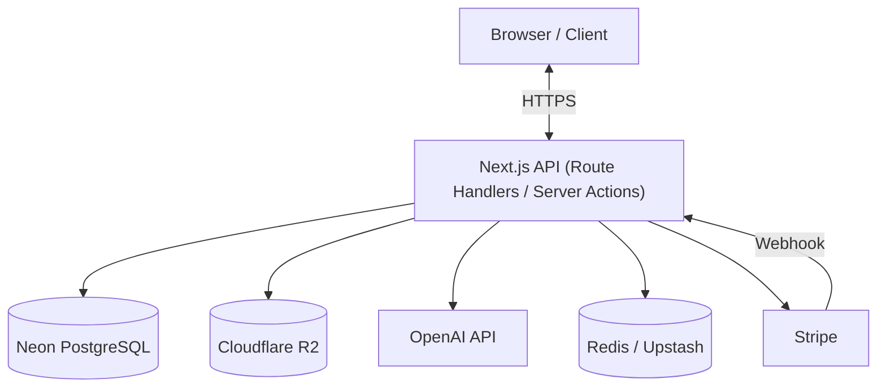
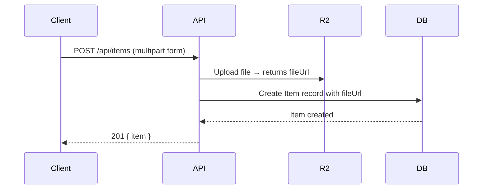
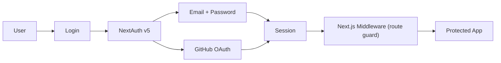
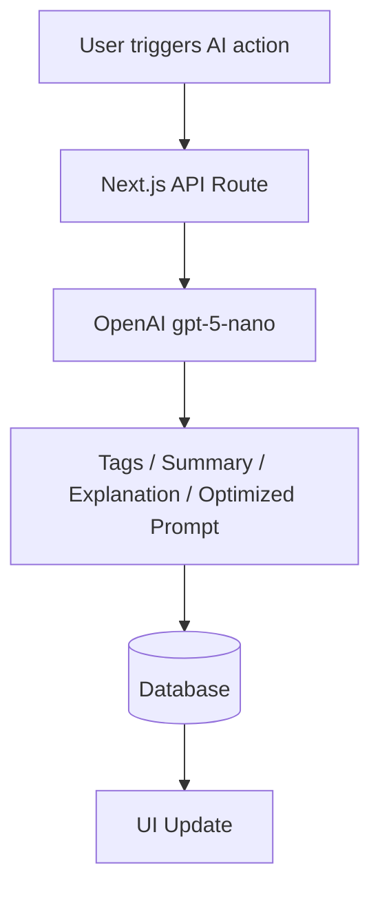

# DevStash — Project Specification

> **Store Smarter. Build Faster.**
> A centralized, AI-enhanced knowledge hub for developers — snippets, prompts, commands, docs, and more in one searchable place.

---

## Table of Contents

1. [Problem & Vision](#1-problem--vision)
2. [User Personas](#2-user-personas)
3. [Core Features](#3-core-features)
4. [Data Model](#4-data-model)
5. [Tech Stack](#5-tech-stack)
6. [Architecture](#6-architecture)
7. [Auth Flow](#7-auth-flow)
8. [AI Features](#8-ai-features)
9. [Monetization](#9-monetization)
10. [UI / UX](#10-ui--ux)
11. [Folder Structure](#11-folder-structure)
12. [API Route Map](#12-api-route-map)
13. [Environment Variables](#13-environment-variables)
14. [Roadmap](#14-roadmap)
15. [Open Questions & Risks](#15-open-questions--risks)

---

## 1. Problem & Vision

Developers scatter their essentials across a dozen tools:

| What | Where it lives |
|---|---|
| Code snippets | VS Code, Notion, GitHub Gists |
| AI prompts | Chat history, `.txt` files |
| Context files | Buried in project repos |
| Useful links | Browser bookmarks |
| Documentation | Random folders |
| Terminal commands | Bash history, sticky notes |
| Project templates | GitHub Gists, local dirs |

This creates **context switching**, **lost knowledge**, and **inconsistent workflows**.

**DevStash** provides one searchable, AI-enhanced hub for all dev knowledge.

---

## 2. User Personas

| Persona | Core Need |
|---|---|
| Everyday Developer | Quick access to snippets, commands, and reference links |
| AI-First Developer | Store and version prompts, workflows, and context files |
| Content Creator / Educator | Save course notes and reusable demo code |
| Full-Stack Builder | Patterns, boilerplates, and API references |

---

## 3. Core Features

### A) Item Types (System)

Every saved resource is an **Item** with one of these built-in types:

| Type | Description |
|---|---|
| `Snippet` | Code blocks with language/syntax highlighting |
| `Prompt` | AI prompt templates |
| `Note` | Free-form text / Markdown |
| `Command` | CLI / terminal commands |
| `File` | Uploaded file (docs, templates, etc.) |
| `Image` | Uploaded image |
| `URL` | Saved link with optional metadata |

> Pro users can create **custom types** with their own icon and color.

### B) Collections

Group items (mixed types allowed) into named collections.

Examples: `React Patterns`, `Context Files`, `Python Snippets`, `Interview Prep`

> ⚠️ **Note:** The current model allows one collection per item. If you want items to live in multiple collections, you'll need a many-to-many `ItemCollection` join table — worth deciding early.

### C) Search

Full-text search across:

- Item title
- Item content
- Tags
- Item type name

> Consider [Postgres full-text search with `tsvector`](https://www.postgresql.org/docs/current/textsearch.html) before reaching for a dedicated search service. It handles most use cases well at this scale.

### D) Authentication

- Email + Password
- GitHub OAuth

### E) Additional Features

- ⭐ Favorites & pinned items
- 🕐 Recently used (tracked via `lastUsedAt`)
- 📥 Import from file
- ✍️ Markdown editor for text items
- 📁 File uploads (images, docs, templates)
- 📤 Export as JSON or ZIP
- 🌑 Dark mode (default)

### F) AI Features

| Feature | Description |
|---|---|
| Auto-tagging | Suggest relevant tags based on content |
| AI Summary | One-line summary stored on the item |
| Explain Code | Natural language explanation of code snippets |
| Prompt Optimizer | Rewrite/improve a saved AI prompt |

> Powered by **OpenAI gpt-5-nano** (fast & cheap — good fit for short-context tasks).

---

## 4. Data Model

> Schema is a starting point and will evolve. Uses [Prisma ORM](https://www.prisma.io/docs).

### Key design decisions

- `contentType` on `Item` distinguishes text items (stored in `content`) from file items (stored in R2, referenced via `fileUrl`)
- `isSystem` on `ItemType` separates built-in types (seeded, no `userId`) from user-created custom types
- `lastUsedAt` enables "Recently Used" sorting without a separate table

### Improved Prisma Schema

```prisma
// schema.prisma

generator client {
  provider = "prisma-client-js"
}

datasource db {
  provider = "postgresql"
  url      = env("DATABASE_URL")
}

model User {
  id                   String       @id @default(cuid())
  email                String       @unique
  password             String?      // null for OAuth-only users
  isPro                Boolean      @default(false)
  stripeCustomerId     String?      @unique
  stripeSubscriptionId String?      @unique
  items                Item[]
  itemTypes            ItemType[]
  collections          Collection[]
  tags                 Tag[]
  createdAt            DateTime     @default(now())
  updatedAt            DateTime     @updatedAt
}

model Item {
  id           String     @id @default(cuid())
  title        String
  contentType  String     // "text" | "file"
  content      String?    // for text-based types
  fileUrl      String?    // R2 object URL
  fileName     String?
  fileSize     Int?       // bytes
  url          String?    // for URL type items
  description  String?
  aiSummary    String?    // stored after AI summary generation
  language     String?    // e.g. "typescript", "python"
  isFavorite   Boolean    @default(false)
  isPinned     Boolean    @default(false)
  lastUsedAt   DateTime?  // updated on item open — drives "Recently Used"
  usageCount   Int        @default(0)

  userId       String
  user         User       @relation(fields: [userId], references: [id], onDelete: Cascade)

  typeId       String
  type         ItemType   @relation(fields: [typeId], references: [id])

  collectionId String?
  collection   Collection? @relation(fields: [collectionId], references: [id], onDelete: SetNull)

  tags         ItemTag[]

  createdAt    DateTime   @default(now())
  updatedAt    DateTime   @updatedAt

  @@index([userId])
  @@index([collectionId])
  @@index([typeId])
  @@index([lastUsedAt])
}

model ItemType {
  id       String  @id @default(cuid())
  name     String
  icon     String?
  color    String?
  isSystem Boolean @default(false)

  userId   String?
  user     User?   @relation(fields: [userId], references: [id], onDelete: Cascade)

  items    Item[]

  @@unique([name, userId]) // prevents duplicate custom type names per user
}

model Collection {
  id          String   @id @default(cuid())
  name        String
  description String?
  isFavorite  Boolean  @default(false)

  userId      String
  user        User     @relation(fields: [userId], references: [id], onDelete: Cascade)

  items       Item[]

  createdAt   DateTime @default(now())
  updatedAt   DateTime @updatedAt

  @@index([userId])
}

model Tag {
  id     String    @id @default(cuid())
  name   String
  userId String
  user   User      @relation(fields: [userId], references: [id], onDelete: Cascade)
  items  ItemTag[]

  @@unique([name, userId]) // prevents duplicate tag names per user
}

model ItemTag {
  itemId String
  tagId  String
  item   Item   @relation(fields: [itemId], references: [id], onDelete: Cascade)
  tag    Tag    @relation(fields: [tagId], references: [id], onDelete: Cascade)

  @@id([itemId, tagId])
}
```

### Schema Notes

- All `onDelete: Cascade` rules ensure no orphaned records when a user or collection is deleted.
- `@@index` annotations are critical for query performance — Neon/Postgres won't index foreign keys by default.
- `aiSummary` stored on the `Item` means you're not regenerating on every render; call AI once and persist.
- Consider adding `metadata Json?` to `Item` for flexible, type-specific extra data without constant migrations.

### ⚠️ Migration Rules — Read This First

**Never use `prisma db push`.** It bypasses the migration system, leaves no history, and can cause data loss in production without warning.

Always use the proper migration workflow:

```bash
# Create and apply a named migration (dev)
npx prisma migrate dev --name descriptive-name-here

# Apply existing migrations in CI / production (never generates new ones)
npx prisma migrate deploy

# After pulling schema changes from a teammate
npx prisma migrate dev

# Seed the database (runs prisma/seed.ts)
npx prisma db seed
```

| Command | When to use |
|---|---|
| `prisma migrate dev` | Local development — creates a `.sql` file in `prisma/migrations/` and applies it |
| `prisma migrate deploy` | CI, staging, production — applies pending migrations only, never creates new ones |
| `prisma db seed` | Populate system ItemTypes and any other initial data |
| `prisma studio` | Visual DB browser during development |
| `prisma db push` | **Never.** Prototyping only, and only on a throwaway local DB |

> Migration files in `prisma/migrations/` are part of the codebase — commit them. They are the source of truth for your database history.

---

## 5. Tech Stack

| Category | Choice | Notes |
|---|---|---|
| Framework | [Next.js 15 (App Router)](https://nextjs.org/docs) | React 19, Server Components, Server Actions |
| Language | [TypeScript](https://www.typescriptlang.org/docs/) | Strict mode recommended |
| Database | [Neon PostgreSQL](https://neon.tech/docs) | Serverless-friendly, branching for dev/staging |
| ORM | [Prisma](https://www.prisma.io/docs) | Type-safe, great DX; watch cold start time |
| Caching | [Redis via Upstash](https://upstash.com/docs/redis) | Serverless Redis — pairs well with Vercel |
| File Storage | [Cloudflare R2](https://developers.cloudflare.com/r2/) | S3-compatible, no egress fees |
| CSS / UI | [Tailwind v4](https://tailwindcss.com/docs) + [shadcn/ui](https://ui.shadcn.com) | shadcn components are copy-owned, not a dep |
| Auth | [NextAuth v5 (Auth.js)](https://authjs.dev/getting-started) | Email + GitHub; v5 has breaking changes vs v4 |
| AI | [OpenAI SDK](https://platform.openai.com/docs/libraries/node-js-library) | gpt-5-nano for cost efficiency |
| Payments | [Stripe](https://stripe.com/docs) | Subscriptions + webhooks |
| Deployment | [Vercel](https://vercel.com/docs) | Native Next.js support |
| Monitoring | [Sentry](https://docs.sentry.io/platforms/javascript/guides/nextjs/) | Add early — cheap insurance |
| Code Highlighting | [Shiki](https://shiki.style) | Server-side, fast, VS Code themes |

### Tradeoffs to Know

**Prisma on serverless (Neon + Vercel)**
> Cold starts can add latency. Use [Prisma Accelerate](https://www.prisma.io/data-platform/accelerate) or the [Neon serverless driver](https://neon.tech/docs/serverless/serverless-driver) for connection pooling. Don't skip this — you will hit connection limits.

**NextAuth v5**
> The v5 API is substantially different from v4. Follow [Auth.js v5 docs](https://authjs.dev/getting-started/migrating-to-v5) specifically, not generic NextAuth guides — most tutorials online are for v4.

**Cloudflare R2**
> No egress fees is a major win. Use signed URLs for private file access. The R2 SDK is S3-compatible, so `@aws-sdk/client-s3` works fine.

**shadcn/ui**
> Not an npm package — components are generated into your codebase. This is intentional; you own and can modify every component. Run `npx shadcn@latest add <component>` to add what you need.

---

## 6. Architecture



### Data Flow — Item Creation (File Upload)



---

## 7. Auth Flow



> Session stored as a signed JWT in an HTTP-only cookie. Middleware runs on the edge and blocks unauthenticated requests to `/dashboard/*` and `/api/*` routes.

---

## 8. AI Features



### Implementation Notes

- **Auto-tagging**: Send item `title + content` (truncated), ask for 3–5 tag suggestions in JSON. Store on confirm.
- **AI Summary**: Single sentence. Store in `aiSummary` on `Item`. Regenerate on demand.
- **Explain Code**: Stream the response for better perceived performance (`stream: true`).
- **Prompt Optimizer**: Show diff or side-by-side view before overwriting.
- Rate-limit AI endpoints per user (e.g. 20 calls/day on Free, unlimited on Pro) using Redis counters.

---

## 9. Monetization

| Plan | Price | Item Limit | Collections | AI Features | File Uploads | Custom Types | Export |
|---|---|---|---|---|---|---|---|
| Free | $0 | 50 items | 3 | ❌ | Images only | ❌ | ❌ |
| Pro | $8/mo or $72/yr | Unlimited | Unlimited | ✅ | All types | ✅ | ✅ (JSON / ZIP) |

**Stripe integration:**

- `stripe.subscriptions.create` on upgrade
- Webhook (`customer.subscription.updated`, `customer.subscription.deleted`) syncs `isPro` on the `User` model
- Store `stripeCustomerId` and `stripeSubscriptionId` on `User` for portal access

> Use [Stripe's Customer Portal](https://stripe.com/docs/customer-management) to handle plan changes and cancellations — don't build that UI yourself.

### Enforcement

Create a `checkProAccess(userId)` server utility. Call it in Server Actions and API routes before any Pro-gated operation. Don't rely solely on client-side UI hiding.

---

## 10. UI / UX

- **Dark mode first**, light mode as an option
- Minimal, developer-friendly aesthetic — inspired by Notion, Linear, and Raycast
- Syntax highlighting via [Shiki](https://shiki.style) (supports 100+ languages, VS Code themes)

### Layout

```
┌─────────────────────────────────────────────────────┐
│  Sidebar (collapsible)     │  Main Workspace         │
│  ─────────────────────     │  ─────────────────────  │
│  Search                    │  Grid / List view        │
│  ─ All Items               │  Item cards              │
│  ─ Favorites               │                         │
│  ─ Recent                  │                         │
│  Collections               │                         │
│  ─ React Patterns          │                         │
│  ─ Python Snippets         │                         │
│  Filter by Type            │                         │
│  Filter by Tag             │                         │
└─────────────────────────────────────────────────────┘
```

- Mobile: sidebar becomes a **bottom drawer**
- Item editor opens as a **full-screen modal or slide-over panel**
- Keyboard shortcut: `Cmd+K` for quick search / command palette (Raycast-style)

---

## 11. Folder Structure

Recommended Next.js App Router layout:

```
devstash/
├── app/
│   ├── (auth)/
│   │   ├── login/page.tsx
│   │   └── register/page.tsx
│   ├── (dashboard)/
│   │   ├── layout.tsx          # Sidebar + main layout
│   │   ├── page.tsx            # All items view
│   │   ├── collections/
│   │   │   └── [id]/page.tsx
│   │   └── settings/page.tsx
│   └── api/
│       ├── items/
│       │   ├── route.ts        # GET (list), POST (create)
│       │   └── [id]/route.ts   # GET, PATCH, DELETE
│       ├── collections/route.ts
│       ├── tags/route.ts
│       ├── ai/
│       │   ├── tag/route.ts
│       │   ├── summarize/route.ts
│       │   └── explain/route.ts
│       ├── upload/route.ts     # R2 file upload
│       └── webhooks/
│           └── stripe/route.ts
├── components/
│   ├── ui/                     # shadcn components (auto-generated)
│   ├── items/
│   │   ├── ItemCard.tsx
│   │   ├── ItemEditor.tsx
│   │   └── ItemGrid.tsx
│   ├── collections/
│   ├── sidebar/
│   └── shared/
├── lib/
│   ├── prisma.ts               # Prisma client singleton
│   ├── auth.ts                 # NextAuth config
│   ├── r2.ts                   # R2 / S3 client
│   ├── openai.ts               # OpenAI client
│   ├── stripe.ts               # Stripe client
│   └── utils.ts
├── hooks/                      # Custom React hooks
├── types/                      # Shared TypeScript types
├── prisma/
│   ├── schema.prisma
│   └── seed.ts                 # Seeds system ItemTypes
├── middleware.ts               # Auth route protection
└── .env.local
```

---

## 12. API Route Map

| Method | Route | Description | Auth | Pro |
|---|---|---|---|---|
| `GET` | `/api/items` | List items (with filters) | ✅ | — |
| `POST` | `/api/items` | Create item | ✅ | Limit enforced |
| `GET` | `/api/items/:id` | Get single item | ✅ | — |
| `PATCH` | `/api/items/:id` | Update item | ✅ | — |
| `DELETE` | `/api/items/:id` | Delete item | ✅ | — |
| `GET` | `/api/collections` | List collections | ✅ | — |
| `POST` | `/api/collections` | Create collection | ✅ | Limit enforced |
| `PATCH` | `/api/collections/:id` | Update collection | ✅ | — |
| `DELETE` | `/api/collections/:id` | Delete collection | ✅ | — |
| `GET` | `/api/tags` | List tags | ✅ | — |
| `POST` | `/api/upload` | Upload file to R2 | ✅ | Pro only (non-image) |
| `POST` | `/api/ai/tag` | AI auto-tag | ✅ | ✅ |
| `POST` | `/api/ai/summarize` | AI summary | ✅ | ✅ |
| `POST` | `/api/ai/explain` | Explain code | ✅ | ✅ |
| `POST` | `/api/webhooks/stripe` | Stripe webhook | — | — |

---

## 13. Environment Variables

```bash
# .env.local

# Database
DATABASE_URL="postgresql://..."           # Neon connection string (pooled)
DATABASE_URL_UNPOOLED="postgresql://..."  # Direct URL for Prisma migrations

# Auth
AUTH_SECRET="..."                         # NextAuth secret (openssl rand -base64 32)
AUTH_GITHUB_ID="..."
AUTH_GITHUB_SECRET="..."

# Cloudflare R2
R2_ACCOUNT_ID="..."
R2_ACCESS_KEY_ID="..."
R2_SECRET_ACCESS_KEY="..."
R2_BUCKET_NAME="devstash"
R2_PUBLIC_URL="https://..."              # Public bucket URL or custom domain

# OpenAI
OPENAI_API_KEY="..."

# Stripe
STRIPE_SECRET_KEY="..."
STRIPE_WEBHOOK_SECRET="..."
NEXT_PUBLIC_STRIPE_PUBLISHABLE_KEY="..."

# Redis (Upstash)
UPSTASH_REDIS_REST_URL="..."
UPSTASH_REDIS_REST_TOKEN="..."
```

---

## 14. Roadmap

### MVP (Launch)

- [ ] Project setup (Next.js, Prisma, shadcn, auth)
- [ ] System ItemType seed
- [ ] Items CRUD (text-based types)
- [ ] Collections CRUD
- [ ] Tags (create, assign, filter)
- [ ] Full-text search
- [ ] Favorites & pinned
- [ ] Recently used view
- [ ] Free tier limits enforcement
- [ ] Dark mode UI

### Pro Phase

- [ ] File uploads via R2
- [ ] Markdown editor
- [ ] AI features (auto-tag, summarize, explain, optimize)
- [ ] Custom item types
- [ ] Export (JSON / ZIP)
- [ ] Stripe billing + upgrade flow
- [ ] Stripe Customer Portal

### Post-Launch

- [ ] Import from file / GitHub Gist
- [ ] Shared / public collections
- [ ] Team & Org plans
- [ ] VS Code extension
- [ ] Browser extension (save-to-DevStash)
- [ ] CLI tool (`devstash push snippet.ts`)
- [ ] API access (Pro)

---

## 15. Open Questions & Risks

| # | Topic | Question / Risk | Suggested Resolution |
|---|---|---|---|
| 1 | **Item ↔ Collection** | Items can only belong to one collection. Is that the intended UX? | Decide before building. Many-to-many requires a `ItemCollection` join table. Adds complexity but more flexible. |
| 2 | **Free tier enforcement** | Where is the item/collection limit enforced — client, server, or both? | Server only (client is cosmetic). Check count before insert in Server Action / API route. |
| 3 | **Prisma cold starts** | Neon + Vercel serverless can exhaust DB connections under load | Use Neon's pooled connection string + consider Prisma Accelerate for connection pooling |
| 4 | **AI cost control** | gpt-5-nano is cheap but costs add up with many users | Per-user rate limits via Redis counters; add daily cap on free tier |
| 5 | **File security** | R2 files are either fully public or require signed URLs | Use pre-signed URLs with expiry for private files. Never expose raw R2 object paths in the DB if bucket is private. |
| 6 | **Search at scale** | Postgres full-text search is good up to ~100k rows per user, then degrades | Start with `tsvector`. Re-evaluate with [Typesense](https://typesense.org) or [Algolia](https://www.algolia.com) if needed. |
| 7 | **Stripe webhooks in dev** | Webhooks won't hit `localhost` | Use [Stripe CLI](https://stripe.com/docs/stripe-cli) (`stripe listen --forward-to localhost:3000/api/webhooks/stripe`) |
| 8 | **Seed data** | System ItemTypes need to be in DB before app runs | Write a `prisma/seed.ts` and add `"prisma": { "seed": "ts-node prisma/seed.ts" }` to `package.json` |

---

## Useful Links

| Resource | URL |
|---|---|
| Next.js App Router docs | <https://nextjs.org/docs/app> |
| Prisma with Neon | <https://neon.tech/docs/guides/prisma> |
| Auth.js v5 (NextAuth) | <https://authjs.dev/getting-started> |
| Cloudflare R2 + AWS SDK | <https://developers.cloudflare.com/r2/api/s3/sdk> |
| shadcn/ui | <https://ui.shadcn.com> |
| Tailwind v4 | <https://tailwindcss.com/docs/v4-beta> |
| Shiki syntax highlighter | <https://shiki.style> |
| Stripe subscriptions | <https://stripe.com/docs/billing/subscriptions/overview> |
| Stripe Customer Portal | <https://stripe.com/docs/customer-management> |
| Upstash Redis | <https://upstash.com/docs/redis/overall/getstarted> |
| OpenAI Node SDK | <https://platform.openai.com/docs/libraries/node-js-library> |
| Sentry for Next.js | <https://docs.sentry.io/platforms/javascript/guides/nextjs> |

---

*Last updated: May 2026 — Status: In Planning / Ready for environment setup*
